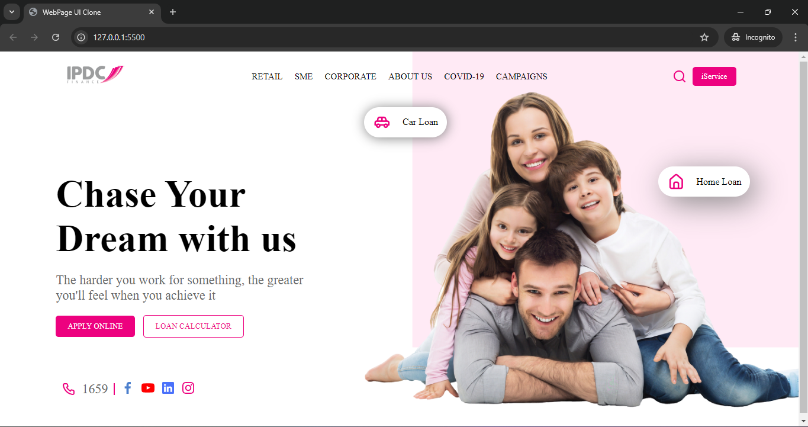

## ITLE OF THE PROJECT ---> BUILDING A WEBPAGE 

In this project, I have created a clone of the given image below. As per the instruction, responsiveness is not required, but since I have tried some of the `@media` query for this project.

> All the required assets have been provided in **Assets** Folder

## Tech used in this project is:
    - HTML
    - CSS

## PROJECT OUTPUT IMAGE

## Prepared By - Akash Kumar Singh